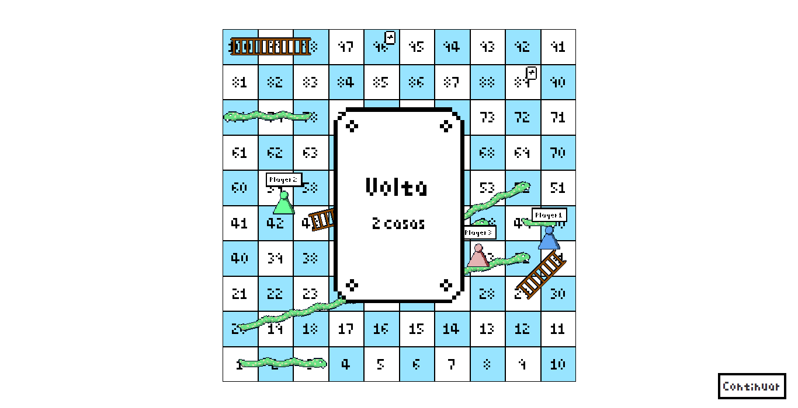

# Escadas e Serpentes



Jogo de escadas e serpentes implementado em Java usando Swing e AWT.

## Objetivo

O objetivo é passar pelo tabuleiro e chegar primeiro ao topo para vencer seu oponente.

## Rodando

Compile e rode o código:

```bash
javac -d out -sourcepath src src/src/escadasSerpentes/Program.java
java -cp out src.escadasSerpentes.Program
```

## Features

O jogo consiste em um tabuleiro com especiais que podem ajudar ou atrapalhar um jogador,
onde os jogadores vão rolando o dado para jogar e ganha quem chega primeiro ao topo.

O mínimo de jogadores é 2 e o máximo é 4.

Há três especiais:

- Escadas: Levam o player da casa na base destas para a casa no topo delas
- Serpentes: Levam o player da casa no topo destas para a base delas
- Cartas: Podem ajudar ou atrapalhar o player fazendo ele ir para frente ou para trás 1-3 casas
